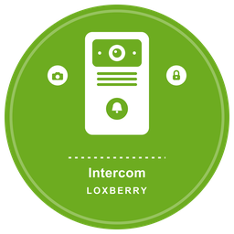

# LoxBerry-Plugin Intercom

Dieses Loxberry Plugin greift Fotos der Loxone Intercom ab um sie für andere Anwendungen vorzuhalten. Das Plugin kann über einen Virtuellen Ausgang aus der Loxone Config heraus aufgerufen werden. Anschließend werden die Bilder über eine URL bereitgestellt und es besteht die möglichkeit einen weitern Webhook aufzurufen um die Bild URL an andere Programme / Scripte weiterzugeben.

## Unterstützte Türstationen

**Loxone Intercom (Gen. 1)**, **Loxone Intercom Gen. 2** und **Loxone Intercom XL**.

Das Plugin fragt bei allen dreien denselben Weg ab — den MJPEG-Strom unter
`/mjpg/video.mjpg`, mit den Zugangsdaten aus der Miniserver-Konfiguration.
Es gibt deshalb keine Modellauswahl und nichts modellabhängig einzustellen:
Was zählt, ist allein, ob die Türstation diesen Strom anbietet. Der Reiter
*Test* holt ein Bild ohne Umweg über Loxone und beantwortet das in einem Schritt.

Das Plugin ist QuickAndDirty aus einem Beitrag des Loxforum.com entstanden.

https://www.loxforum.com/forum/hardware-zubeh%C3%B6r-sensorik/330121-loxone-intercom-gen2-webschnittstelle-um-bild-video-rauszubekommen/page3#post343007
https://www.loxforum.com/forum/hardware-zubeh%C3%B6r-sensorik/353631-warnung-loxone-intercom-gen-2-aktuell-bekannte-probleme#post356031

## Neu in 2.1.12

**Die unterstützten Türstationen stehen jetzt richtig da.** README und Hilfe
nannten nur die *Intercom Version 2*. Tatsächlich arbeitet das Plugin
gleichermaßen mit **Intercom (Gen. 1)**, **Intercom Gen. 2** und
**Intercom XL** — es fragt bei allen denselben MJPEG-Strom unter
`/mjpg/video.mjpg` ab und kennt keine Modellunterscheidung. Wer eine Gen. 1
oder eine XL besitzt, hätte nach der alten Beschreibung angenommen, das Plugin
sei nichts für ihn.

**Der Plugin-Titel wird wieder aus der `plugin.cfg` gelesen.** `ic_titel()`
holte ihn mit `parse_ini_file()` — die Datei kommentiert aber mit `#`, und PHPs
INI-Zerleger kennt seit PHP 7 nur noch `;`. Er las die Kommentare als
Zuweisungen und brach an der ersten Zeile mit einem Sonderzeichen ab.
`parse_ini_file()` gab dann `false` zurück (gemessen unter 7.4.33 und 8.4.24,
beide gleich), das vorangestellte `@` verschluckte die Warnung, und die
Funktion lieferte still ihren Vorgabewert.

Aufgefallen war es nie, weil der Vorgabewert zufällig derselbe Titel ist. Wer
die `plugin.cfg` änderte, hätte sich aber gewundert, warum die Kopfzeile
stehen bleibt — und genau dagegen war die Funktion gebaut.

Jetzt werden die `#`-Kommentarzeilen vor dem Zerlegen entfernt. Nur ganze
Zeilen, deren erstes sichtbares Zeichen `#` ist — ein `#` **innerhalb** eines
Wertes bleibt erhalten.

## Installation

Aktuelle Release URL in das URL Feld bei der Loxberry Plugininstallation kopieren.

## Funktionsumfang

- Manuelle Bildaufname über Trigger ( http://<IP>/plugins/intercom/getpicture.php )
- LoxConfig Intercom Bild an Loxberry Plugin über Virtuellen Ausgang übergeben
- Webhook via POST-/GET-Request bzw. MQTT-Broker
- Bilder Archiv für Bilder die über URL Trigger angestossen wurden
- Video aufnahme durch URL Trigger mit Angabe der Videolänge (max 120 Sekunden http://<IP>/plugins/intercom/getvideo.php?s=<SEKUNDEN> )
- Videoaufnahmen mit Zeitsatempel (optional) über Trigger ( http://<IP>/plugins/intercom/getpicture.php )
- Video Archiv
- Video stream Proxy ( http://<IP>/plugins/intercom/mjpgproxy.php ) ohne authentifizierung

## Anwendungsfälle

- Bild / Video aufzeichnen wenn der Briefkasten über einen Sensor auslöst
- Bild / Video aufzeichnen wenn der Näherungssensor auslöst oder ein Bewegungsmelder
- Bilder der Intercom inhouse archivieren (sonst liegen sie nur auf der SD Karte in der Intercom)

## Dank

Vielen Dank an das Loxberry Forum speziell Laubi und hismastersvoice für die Informationen zum Bilderauslesen.

Folgende Librarys wurden verwendet

- https://github.com/simonwalz/php-mjpeg-proxy
- http://www.lavrsen.dk/foswiki/bin/view/Motion/MjpegFrameGrabPHP

## ChangeLog

1.3.6

- FUntionalität für das Löschen aller Bilder / Videos hinzugefügt.

1.3.5

- Video Webhook funktionierte nicht wurde nun behoben

1.3.4

- Video Webhook (POST/GET/MQTT)

1.3.3

- update fix

1.3.2

- Einstellungen Verzeichnis gewechselt und Speicherung übersteht nun das Update
- Alte Medien werden nach Update nun nicht mehr gelöscht

1.3.1

- ffmpeg hinzugefügt
- Videoaufzeichnung kann über URL Trigger angestossen werden. Videolänge als Parameter.
- video von mjpgproxy.php mit ffmpeg aufnehmen und abspeichern.

## Feature Requests 

- Zeitstempel als option video / Foto
- ffmpeg mit plugin mit installieren
- update testen ob bilderarchiv bleibt
- update testen ob einstellungen bleiben
- eine Einstellmöglichkeit, wo die Bilder genau landen (z.B. auf einem externen USB-Speicher)
- evtl objekterkennung
- Bild an TV senden (Android TV)
- Timelapse Funktion jeden Tag ein Foto schießen zu bestimmter Uhrzeit
- Bild alle X Sekunden mit Bilderkennung!? javscript library?
- Bild bei Briefkaseten trigger (mehrere trigger ermöglichen)
- aktuell geht das Auslesen nur für den ersten hinterlegten Miniserver

- Bilder bei update nicht löschen
- AI erkennung bei getpicture.php 
- schauen was machen andere klingeln noch so was man übernehmen kann

## Umstieg auf 2.0.0

Ab 2.0.0 heißt das Plugin **Intercom**, Ordner `intercom`. Es ist damit
vollständig vom Original getrennt und kann daneben installiert werden. Dafür
wandern die Adressen mit — **bitte vor dem Update lesen.**

### In Loxone Config nachziehen

Jeder virtuelle Ausgang, der auf das Plugin zeigt, muss von
`/plugins/intercom22lox/…` auf `/plugins/intercom/…` umgestellt werden:

| bisher | ab 2.0.0 |
|---|---|
| `http://<LoxBerry>/plugins/intercom22lox/getpicture.php` | `http://<LoxBerry>/plugins/intercom/getpicture.php` |
| `http://<LoxBerry>/plugins/intercom22lox/getvideo.php?s=…` | `http://<LoxBerry>/plugins/intercom/getvideo.php?s=…` |
| `http://<LoxBerry>/plugins/intercom22lox/mjpgproxy.php` | `http://<LoxBerry>/plugins/intercom/mjpgproxy.php` |
| `http://<LoxBerry>/plugins/intercom22lox/lastpicture.jpg` | `http://<LoxBerry>/plugins/intercom/lastpicture.jpg` |

Das Zugriffstoken (seit 1.6.0 Pflicht) hängt unverändert an jeder dieser
Adressen. Die fertigen Adressen samt Token stehen im Reiter **Anleitung**.

### Im MQTT-Gateway nachziehen

Die Themen heißen ebenfalls neu. Das Abo `intercom22lox/#` ist auf `intercom/#`
zu ändern, und die Bausteine, die auf die Themen hören, entsprechend:

| bisher | ab 2.0.0 |
|---|---|
| `intercom22lox` | `intercom` |
| `intercom22loxvideo` | `intercomvideo` |
| `intercom22lox/trigger/NAME` | `intercom/trigger/NAME` |
| `intercom22lox/ai` | `intercom/ai` |

### Was von selbst passiert

- **Das Bild- und Videoarchiv wird übernommen.** `postinstall.sh` verschiebt
  `webfrontend/legacy/intercom22lox_data` nach `…/intercom_data`. Verschoben
  wird nur, wenn der neue Ordner noch nicht existiert — ein vorhandenes Archiv
  wird unter keinen Umständen überschrieben. Klappt das Verschieben nicht, steht
  der Befehl für die Hand in der Installationsausgabe.
- **Die Protokollansicht findet auch den alten Bestand.** Gesucht werden
  `intercom.log` und `intercom22lox.log`.
- **Der Speicherort auf externem Medium** wird jetzt aus dem Ordnernamen
  abgeleitet statt fest eingetragen. Wer einen Pfad hinterlegt hat, bekommt dort
  einen Ordner `intercom_data`; der alte `intercom22lox_data` bleibt liegen und
  kann nach dem Umstieg von Hand entfernt werden.

### Was Sie selbst tun müssen

Die Konfiguration (Adresse der Intercom, Webhooks, Speicherort, KI-Einstellungen)
wandert **nicht** mit, weil LoxBerry das Plugin als neues führt. Sie ist einmal
neu einzutragen. Ein Blick in die alte Oberfläche vor der Deinstallation lohnt
sich.

## Änderungen in 1.6.0

### Sicherheit — bitte zeitnah aktualisieren

**Befehlsausführung über die Host-Kopfzeile (`getvideo.php`).** Das Skript setzte
`$_SERVER['HTTP_HOST']` unmaskiert in eine Zeichenkette ein, die an die Shell
ging — zweimal, im ffmpeg-Aufruf und im angehängten `wget`. `HTTP_HOST` ist der
Inhalt der Host-Kopfzeile und wird ausschließlich vom Aufrufer bestimmt. Eine
Anfrage mit einer passend gewählten Host-Kopfzeile brachte den LoxBerry dazu,
einen beliebigen Befehl auszuführen. Die Datei liegt unter `webfrontend/html/`,
also im **unangemeldeten** Bereich, und hatte **keine** Zugriffsprüfung: wer den
LoxBerry über HTTP erreichte, hatte eine Befehlszeile darauf.

Behoben durch drei Dinge: für Aufrufe an den eigenen Rechner wird `127.0.0.1`
benutzt (die Host-Kopfzeile wird dafür gar nicht gebraucht), jedes Argument läuft
durch `escapeshellarg()`, und der Aufruf verlangt ein Token. Gegen sechs
Einschleusungsmuster geprüft: vorher fünf ausführbar, nachher keines — der Host
kommt in der Befehlszeile nicht mehr vor.

*Zur Einordnung des ursprünglichen Befunds:* der Prüfer zielte auf
`$_REQUEST['s']`. Dort ist die Lage milder — `is_numeric()` lässt zwar `1e3` oder
`" 12"` durch, aber keine Shell-Sonderzeichen. Aus `s` ließ sich keine
Befehlsausführung bauen, wohl aber eine 1000-Sekunden-Aufnahme. `s` ist jetzt
eine ganze Zahl zwischen 1 und 300.

**Alle Endpunkte waren ungeschützt.** `getpicture.php`, `getvideo.php`,
`videowebhook.php` und `mjpgproxy.php` liegen im unangemeldeten Bereich und
hatten keinerlei Prüfung. Jedes Gerät im Netz konnte den **Kamerastrom der
Haustür** mitlesen, Bilder auslösen und Videoaufzeichnungen starten. Alle vier
verlangen jetzt ein Zugriffstoken; `timelapse.php` und `cleanup.php` laufen nur
noch über die Kommandozeile (Cron) und weisen HTTP-Aufrufe ab.

### Weitere behobene Fehler

- **Endlosschleife im Bildabruf.** `while (substr_count($r,"Content-Length") != 2)`
  hatte keine Abbruchbedingung. In `timelapse.php` war der Wächter bereits
  richtig eingebaut, in `getpicture.php` fehlte er — jetzt dort ebenso, dazu eine
  Zeitgrenze auf dem Datenstrom.
- **Halbe JPEGs.** `file_put_contents("lastpicture.jpg", ...)` schrieb unmittelbar
  in die Zieldatei. Klingel und Bewegungsmelder gleichzeitig, und beide Prozesse
  schrieben ineinander. Jetzt Zwischendatei und `rename()`.
- **Fest eingetragener Ordnername.** `require_once "../../../htmlauth/plugins/<Ordner>/config.php"`
  stand in sechs Dateien, dazu in `script.js`, `live.php` und `videoarchive.php`.
  Bei einer Zweitinstallation heißt der Ordner `intercom_01` — dann zeigten
  alle Verweise auf die Vorgängerinstallation oder ins Leere. Der Ordnername wird
  jetzt ermittelt.
- **Ungeprüfter Dateiname** in `videowebhook.php`: jetzt `basename()`, ein Muster
  und die Prüfung, dass die Datei im Archiv wirklich existiert.
- **Webhooks ohne Zeitgrenze.** `file_get_contents($url)` ohne Zusammenhang nimmt
  `default_socket_timeout`, üblicherweise 60 Sekunden. Ein abgeschalteter
  Node-RED hielt den Aufruf eine Minute fest, und der Miniserver wartete mit.
  Auch die cURL-Aufrufe hatten keine Zeitgrenze.
- **MQTT ohne `Bluerhinos\phpMQTT`.** Jetzt über das LoxBerry-MQTT-Gateway per
  UDP — ein Paket statt einer TCP-Verbindung mit Anmeldung, und keine fremde
  Bibliothek mehr, die unter PHP 8 ausfallen kann.
- **`json_encode`-Falle beim Speichern.** Die alte Prüfung hätte eine geleerte
  Konfigurationsdatei für einen Erfolg gehalten.
- **Falscher Parametername in der Anleitung.** Dort stand `getvideo.php?time=15`;
  das Skript liest `s`. Jede so ausgelöste Aufnahme war die voreingestellten
  20 Sekunden lang.

### Update-Skripte

`${ARGV1}_upgrade` statt `$ARGV1\_upgrade`, und die Sicherung liegt nicht mehr
unter `/tmp` (auf dem LoxBerry eine Ramdisk), sondern unter
`data/plugins/<Ordner>/upgrade_sicherung`. Das Bild- und Videoarchiv wird dabei
**nicht** kopiert, sondern nur an seinen dauerhaften Ort verschoben, falls es
noch im alten Plugin-Ordner liegt — eine Kopie von mehreren Gigabyte in einer
Ramdisk wäre im besten Fall sinnlos.

Der auskommentierte `websocat`-Block in `preroot.sh` ist ersatzlos entfernt.

### Nach dem Update

Die Plugin-Oberfläche einmal öffnen: dort steht das neu erzeugte Zugriffstoken
und die fertigen Adressen für die Virtuellen Ausgänge. **Ohne Token weisen die
Endpunkte jeden Aufruf ab** — bestehende Loxone-Konfigurationen müssen einmalig
angepasst werden. Das ist der Preis dafür, dass die Haustürkamera nicht mehr für
jeden im Netz offensteht.

### Zur Frage einer Abspaltung

Diese Fassung wird in einem **eigenen Repository** gepflegt:
[timanders22/LoxBerry-Plugin-Intercom](https://github.com/timanders22/LoxBerry-Plugin-Intercom).
Daraus folgt dreierlei.

**Die Angaben unter `[AUTHOR]` sind eine eigene Projektkennung geworden.** Sie
sind kein Urhebervermerk, sondern das Feld, aus dem LoxBerry zusammen mit
`[PLUGIN] NAME` die Kennzahl bildet, unter der es Installation und Updates
führt. Bis 1.3.6 stand dort der Originalautor mit seiner privaten Mailadresse —
und `RELEASECFG` zeigte auf sein Repository: LoxBerry hätte diese Fassung beim
nächsten Update-Lauf durch die ältere Originalfassung ersetzt. Die
urheberrechtliche Nennung steht jetzt dort, wo sie hingehört: in `NOTICE`, hier
im README und auf der Hilfeseite.

**`NAME` und `FOLDER` heißen seit 2.0.0 `intercom`.** Damit ist die Trennung vom
Original vollständig: eigene Kennung, eigener Ordner, eigener Name. Beide
Fassungen lassen sich nebeneinander installieren, ohne sich in die Quere zu
kommen. Der Preis steht unten unter [Umstieg auf 2.0.0](#umstieg-auf-200) — die
Adressen wandern mit.

**`AUTOMATIC_UPDATES` steht wieder auf `true`**, jetzt aber auf das eigene
Repository gerichtet. Die frühere Begründung für das Abschalten — ein Downgrade
auf das Repository des ursprünglichen Entwicklers — ist damit gegenstandslos
geworden, nicht widerlegt.

### Herkunft und Lizenz

Grundlage ist [intercom22Lox von **bladerb**](https://github.com/bladerb/intercom22lox),
Apache-Lizenz 2.0. Die hier vorgenommenen Änderungen wurden dem Originalautor
zuerst als Pull Requests angeboten; die vollständige Liste steht in `NOTICE`
(Apache-Lizenz 2.0, Abschnitt 4 b). Der Lizenztext in `LICENCE` ist unverändert.

### Aufgeräumt (Altbestand im Paket)

- **`webfrontend/html/tv/send.py`** — ein Bastelversuch mit fest eingetragener
  fest eingetragener fremder IP-Adresse, der ein pip-Paket voraussetzt, das nirgends
  installiert wird. Er lag im **unangemeldeten** Bereich; Apache hat dort keinen
  Handler für `.py` und hätte die Datei samt der IP als Klartext ausgeliefert.
  Die Funktion selbst steckt längst richtig in `getpicture.php`.
- **`webfrontend/html/archive/` und `webfrontend/html/videoarchive/`** — leer, von
  keiner Zeile Code angesprochen. Das Archiv liegt seit Langem unter
  `webfrontend/legacy/<Ordner>_data/`, damit die Bild- und Videoadressen ein
  Plugin-Update überstehen; `preupgrade.sh` holt Altbestände aus den alten
  Ordnern noch ab.
- **`data/data.json`** — 0 Byte groß und im ganzen Plugin nie angesprochen. Der
  Ordner `data/` ist damit ersatzlos entfallen.
- **`config/data.json` war ebenfalls leer** — und eine leere Datei ist kein
  gültiges JSON (`json_decode('')` liefert `null`, nicht ein leeres Objekt).
  Enthält jetzt `{}`.
- **`preinstall.sh` und `preroot.sh`** — beide bestanden ausschließlich aus
  Variablenzuweisungen der LoxBerry-Vorlage und `exit 0`. `preroot.sh` gab
  zusätzlich `$TEMPDIR`, `$ARGV3` und `$ARGV4` aus — drei Namen, die es in
  dieser Datei gar nicht gibt (sie heißen dort `PTEMPDIR`, `PDIR`, `PVERSION`).
  Diese Zeilen haben also seit jeher leere Werte gedruckt.

  Der Nebeneffekt zählt: das Plugin hat damit **kein Skript mehr, das als root
  läuft** — und es braucht auch keines.
- **`postinstall.sh`** war ebenfalls reine Vorlage. Es legt jetzt die
  Archivordner an, setzt `data.json` auf `0600` (darin stehen das Zugriffstoken
  und die Zugangsdaten der Webhooks), prüft, ob `ffmpeg` vorhanden ist, und weist
  auf die neue Token-Pflicht hin.
- **`.gitignore`** ergänzt, damit `lastpicture.jpg`, `.tmp`-Reste und
  `__pycache__` nicht wieder mit ins Paket wandern.

